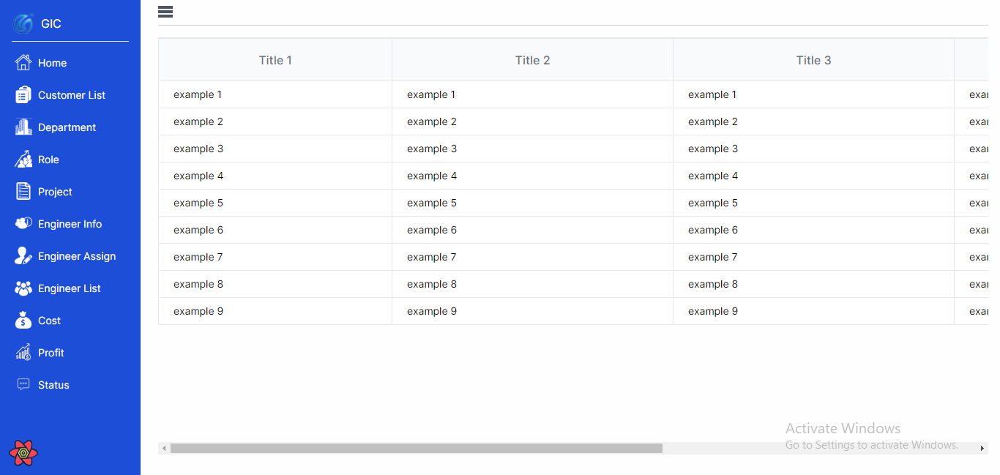
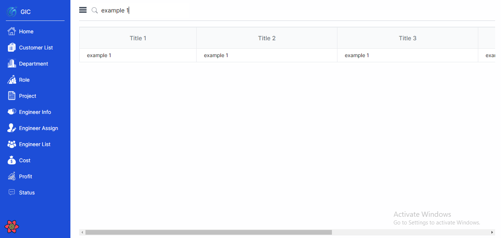
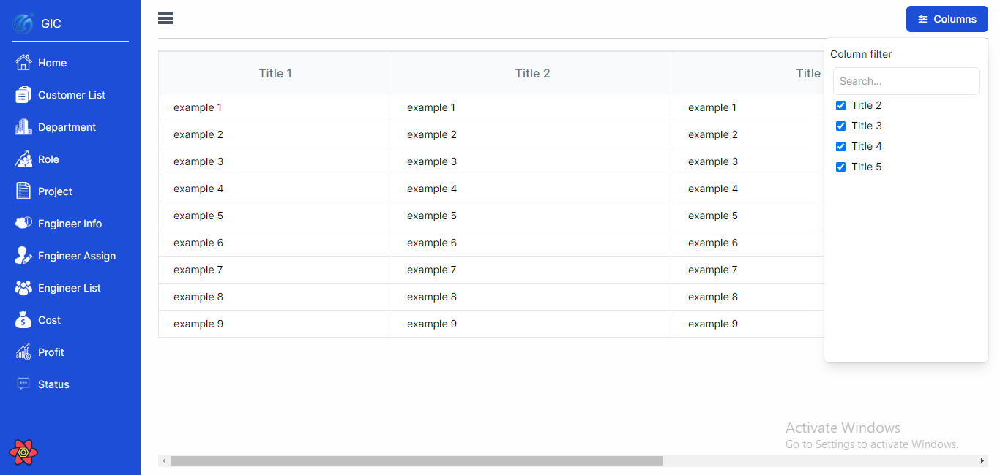
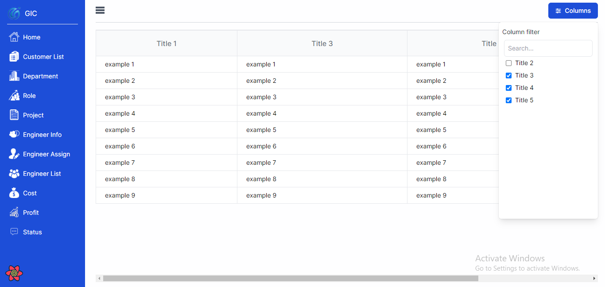

# Project Management System

Global Innovation Consulting Project Management System frontend.

## Set Up

Make sure you have [pnpm](https://pnpm.js.org/) installed globally.

```bash
pnpm install
```

## Coding Standards

-   Make sure to enable prettier and eslint in your editor.
-   Make sure to run `pnpm run lint` before committing.
-   Make sure to run `pnpm run format` before committing.
-   Follow the [Conventional Commit](https://www.conventionalcommits.org/en/v1.0.0/]) message format.

## Project Structure

```
app
├── [lang]
│   ├── components
│   ├── confirm-email
│   ├── cost-summary
│   │   └── components
│   ├── costs
│   │   ├── [id]
│   │   │   └── details
│   │   └── components
│   ├── create-password
│   ├── customers
│   ├── departments
│   │   ├── [id]
│   │   │   └── edit
│   │   │       └── components
│   │   └── assign
│   │       └── components
│   ├── engineers
│   │   ├── assign
│   │   └── components
│   ├── engineers-info
│   │   ├── assign
│   │   │   ├── [id]
│   │   │   └── components
│   │   └── components
│   ├── home
│   │   └── images
│   ├── hooks
│   ├── projects
│   │   ├── [id]
│   │   │   ├── components
│   │   │   ├── japan-myanmar-order
│   │   │   │   └── myanmar-info
│   │   │   ├── japan-order
│   │   │   ├── myanmar-order
│   │   │   └── ses-order
│   │   ├── assign
│   │   │   └── components
│   │   ├── create
│   │   │   ├── components
│   │   │   ├── japan-myanmar-order
│   │   │   │   └── myanmar-info
│   │   │   ├── japan-order
│   │   │   ├── myanmar-order
│   │   │   └── ses-order
│   │   └── current
│   ├── register
│   ├── reset
│   ├── roles
│   │   ├── [id]
│   │   │   └── edit
│   │   └── assign
│   └── users
│       └── components
├── components
│   ├── dropdown
│   ├── error
│   ├── layouts
│   ├── login
│   ├── modal
│   └── table
├── configs
├── const
├── libs
├── store
│   ├── client
│   │   └── features
│   │       ├── counter
│   │       ├── customTable
│   │       ├── department_create
│   │       ├── engineer_assign
│   │       ├── modal
│   │       ├── project_assign
│   │       ├── project_create
│   │       ├── sidebar
│   │       └── url_track
│   └── server
│       └── features
│           ├── costs
│           ├── costsDetails
│           ├── customers
│           ├── departments
│           ├── emp_project_assign
│           ├── employees
│           ├── engineer_assign
│           ├── home
│           ├── member-types
│           ├── projectList
│           ├── project_types
│           ├── projects
│           ├── roles
│           └── todos
└── validation-schemas
    ├── auth
    ├── deparments
    ├── engineer-assign
    ├── projects
    └── roles

99 directories

```

## Before Contributing

-   [How to declare effective React Query Keys](https://tkdodo.eu/blog/effective-react-query-keys#effective-react-query-keys)

## The technology used in the custom table

I use tailwind css and headlessui in the custom table

## The location of the custom table

```
app
 └── [lang]
       └── components
            └── table
                 └──── CustomTable.jsx
```

## Custom table features

-   multiple search
-   column filter for show and hide column
-   multiple column filter for search
-   checkbox for edit and delete

## Custom table examples

```javascript
import CustomTable from '@/app/components/table/CustomTable'

const exampleCustomTable = () => {
    const filtercolumnitem = [
        {
            columnName: 'Title 2',
        },
        {
            columnName: 'Title 3',
        },
        {
            columnName: 'Title 4',
        },
        {
            columnName: 'Title 5',
        },
    ]

    const columns = [
        {
            title: 'Title 1',
            dataIndex: 'title1',
            width: '80',
        },
        {
            title: 'Title 2',
            dataIndex: 'title2',
            width: '96',
        },
        {
            title: 'Title 3',
            dataIndex: 'title3',
            width: '96',
        },
        {
            title: 'Title 4',
            dataIndex: 'title4',
            width: '96',
        },
        {
            title: 'Title 5',
            dataIndex: 'title5',
            width: '96',
        },
    ]

    const data = []
    for (let i = 1; i < 10; i++) {
        data.push({
            key: i,
            title1: `example ${i}`,
            title2: `example ${i}`,
            title3: `example ${i}`,
            title4: `example ${i}`,
            title5: `example ${i}`,
        })
    }

    return (
        <CustomTable
            columns={columns}
            data={data}
            filtercolumnitem={filtercolumnitem}
        />
    )
}
export default exampleCustomTable
```

## Custom table examples screenShot



## Custom table multiple search examples

In the search column name, write the column name you want to search. The column name must be the same as the column written in the dataIndex.

```javascript
const columns = [
    {
        title: 'Title 1',
        dataIndex: 'title1',
        width: '80',
    },
    {
        title: 'Title 2',
        dataIndex: 'title2',
        width: '96',
    },
    {
        title: 'Title 3',
        dataIndex: 'title3',
        width: '96',
    },
    {
        title: 'Title 4',
        dataIndex: 'title4',
        width: '96',
    },
    {
        title: 'Title 5',
        dataIndex: 'title5',
        width: '96',
    },
]
```

```javascript
const searchColumnName = ['title1', 'title2']
```

```javascript
 return (
    <CustomTable
      columns={columns}
      data={data}
      filtercolumnitem={filtercolumnitem}
      searchbar="true"
      searchColumnName={searchColumnName}
    />
  )
```

## Custom table multiple search examples complete code

```javascript
import CustomTable from '@/app/components/table/CustomTable'

const exampleCustomTable = () => {
    const filtercolumnitem = [
        {
            columnName: 'Title 2',
        },
        {
            columnName: 'Title 3',
        },
        {
            columnName: 'Title 4',
        },
        {
            columnName: 'Title 5',
        },
    ]

    const columns = [
        {
            title: 'Title 1',
            dataIndex: 'title1',
            width: '80',
        },
        {
            title: 'Title 2',
            dataIndex: 'title2',
            width: '96',
        },
        {
            title: 'Title 3',
            dataIndex: 'title3',
            width: '96',
        },
        {
            title: 'Title 4',
            dataIndex: 'title4',
            width: '96',
        },
        {
            title: 'Title 5',
            dataIndex: 'title5',
            width: '96',
        },
    ]

    const data = []
    for (let i = 1; i < 10; i++) {
        data.push({
            key: i,
            title1: `example ${i}`,
            title2: `example ${i}`,
            title3: `example ${i}`,
            title4: `example ${i}`,
            title5: `example ${i}`,
        })
    }
    const searchColumnName = ['title1', 'title2']
    return (
        <CustomTable
            columns={columns}
            data={data}
            filtercolumnitem={filtercolumnitem}
            searchbar="true"
            searchColumnName={searchColumnName}
        />
    )
}
export default exampleCustomTable
```

## Custom table multiple search examples screenshot



## Column filter for show and hide column

In signleFilterNames, write the name of the dataIndex to be filtered and change columnfilterbtn to true. The first column cannot be hide.The first column is always show.

```javascript
const columns = [
    {
        title: 'Title 1',
        dataIndex: 'title1',
        width: '80',
    },
    {
        title: 'Title 2',
        dataIndex: 'title2',
        width: '96',
    },
    {
        title: 'Title 3',
        dataIndex: 'title3',
        width: '96',
    },
    {
        title: 'Title 4',
        dataIndex: 'title4',
        width: '96',
    },
    {
        title: 'Title 5',
        dataIndex: 'title5',
        width: '96',
    },
]
```

```javascript
const signleFilterNames = ['title2', 'title3', 'title4', 'title5']
```

```javascript
return (
        <CustomTable
            columns={columns}
            data={data}
            filtercolumnitem={filtercolumnitem}
            columnfilterbtn="true"
            signleFilterNames={signleFilterNames}
        />
    )
```

## Column filter for show and hide column complete code

```javascript
import CustomTable from '@/app/components/table/CustomTable'

const exampleCustomTable = () => {
    const filtercolumnitem = [
        {
            columnName: 'Title 2',
        },
        {
            columnName: 'Title 3',
        },
        {
            columnName: 'Title 4',
        },
        {
            columnName: 'Title 5',
        },
    ]

    const columns = [
        {
            title: 'Title 1',
            dataIndex: 'title1',
            width: '80',
        },
        {
            title: 'Title 2',
            dataIndex: 'title2',
            width: '96',
        },
        {
            title: 'Title 3',
            dataIndex: 'title3',
            width: '96',
        },
        {
            title: 'Title 4',
            dataIndex: 'title4',
            width: '96',
        },
        {
            title: 'Title 5',
            dataIndex: 'title5',
            width: '96',
        },
    ]

    const data = []
    for (let i = 1; i < 10; i++) {
        data.push({
            key: i,
            title1: `example ${i}`,
            title2: `example ${i}`,
            title3: `example ${i}`,
            title4: `example ${i}`,
            title5: `example ${i}`,
        })
    }
    const signleFilterNames = ['title2', 'title3', 'title4', 'title5']
    return (
        <CustomTable
            columns={columns}
            data={data}
            filtercolumnitem={filtercolumnitem}
            columnfilterbtn="true"
            signleFilterNames={signleFilterNames}
        />
    )
}
export default exampleCustomTable
```
## Column filter for show and hide column screenshot 1



## Column filter for show and hide column screenshot 2


